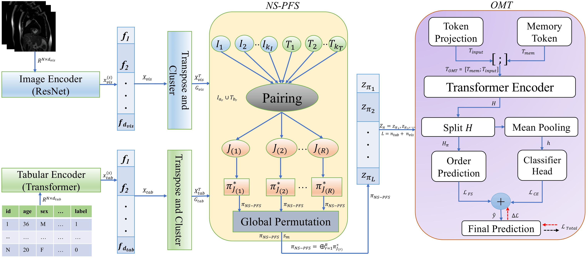

# iSyncTab: Learning Cross-Modal Feature Sequencing for Image-Tabular Data via Neural Synchrony (ECCV 2026)


[](https://eccv.ecva.net/)

[](https://doi.org/10.1007/978-3-032-37035-8)

<p align="center">
  
</p>

iSyncTab is a neural synchrony-guided feature sequencing framework for **multimodal image-tabular learning**. It introduces **Neural Synchrony-guided Paired Feature Sequencing (NS-PFS)** to derive a coherent cross-modal feature order from image and tabular representations, framing feature sequencing through the lens of the **Column Permutation Problem (CPP)**. Rather than treating fused multimodal features as an arbitrarily ordered representation, iSyncTab clusters modality-specific features and aligns image and tabular feature clusters using a synchrony matrix that combines **energy coherence and centroid similarity**, followed by **Hungarian matching** to obtain paired cross-modal clusters. NS-PFS then constructs a synchronized feature sequence that promotes structural coherence and reduces feature dispersion across modalities. The ordered representation is processed by an **Order-aware Memory-augmented Transformer (OMT)** with a Linformer backbone, learnable memory tokens, and an auxiliary sequencing-consistency loss that encourages the model to preserve the learned feature order during prediction. This design makes iSyncTab suitable for heterogeneous image-tabular prediction tasks, including medical imaging and visual classification with structured metadata. Across diverse multimodal benchmarks, iSyncTab demonstrates strong classification performance, improved training stability, data efficiency, and a favorable accuracy-computational cost trade-off compared with tabular-only, image-only, and recent multimodal learning baselines. The generality of the proposed mechanism was further evaluated on **audio-video multimodal data**, demonstrating its applicability beyond image-tabular learning.

## Overview

**iSyncTab** is a multimodal architecture for problems where each example has:

- **Tabular metadata** (numeric + categorical + optional text-like fields), and  
- **Image data** (e.g., medical images, natural images).
- iSyncTab itself is **not specific** to HAM10000/Pokemon/DVM/Deep Lesion/CheXpert/Pet Finder: any dataset with tabular + image inputs can be used by providing a matching PyTorch `Dataset` / `DataLoader`.

The key idea is to treat **both tabular features and image features as tokens**, then use **Neural Synchrony-guided Paired Feature Sequencing (NS-PFS)** to learn a synchronized global permutation across modalities before feeding the ordered token sequence into the **Order-aware Memory-augmented Transformer (OMT)** with a **Linformer** backbone.

## Citation

Al Zadid Sultan Bin Habib, Md Younus Ahamed, Prashnna Kumar Gyawali, Gianfranco Doretto, and Donald A. Adjeroh. **“iSyncTab: Learning Cross-Modal Feature Sequencing for Image-Tabular Data via Neural Synchrony.”** In *Proceedings of the European Conference on Computer Vision (ECCV)*, 2026. https://doi.org/10.1007/978-3-032-37035-8

BibTeX:
```bibtex
@inproceedings{habib2026isynctab,
  title     = {iSyncTab: Learning Cross-Modal Feature Sequencing for Image-Tabular Data via Neural Synchrony},
  author    = {Habib, Al Zadid Sultan Bin and Ahamed, Md Younus and Gyawali, Prashnna Kumar and Doretto, Gianfranco and Adjeroh, Donald A.},
  booktitle = {Proceedings of the European Conference on Computer Vision},
  year      = {2026},
  doi       = {10.1007/978-3-032-37035-8}
}
```
- Paper: https://link.springer.com/chapter/10.1007/978-3-032-37035-8 

## Files and Repository Structure

### Python package: `isynctab/`

This folder contains the core iSyncTab implementations for both image-tabular and audio-video multimodal learning:

- **`__init__.py`** - Package initializer and high-level API exports for `iSyncTab`, `iSyncTab_AV`, and `iSyncTabAV`.

- **`iSyncTab.py`** - Main iSyncTab implementation for **image-tabular multimodal learning**, including:
  - `set_seed` for reproducibility.
  - ResNet-based image token encoding.
  - Tabular token encoding for numerical, categorical, and text-style features.
  - Custom PyTorch-based GPU KMeans clustering.
  - **Neural Synchrony-guided Paired Feature Sequencing (NS-PFS)**.
  - Hungarian matching for cross-modal feature-cluster pairing.
  - Metric-aware feature sequencing and global token permutation.
  - **Order-aware Memory-augmented Transformer (OMT)** with a Linformer backbone.
  - Learnable memory tokens.
  - Classification and feature-sequencing consistency objectives.
  - `iSyncTab` as the high-level image-tabular multimodal model.

- **`iSyncTab_AV.py`** - General audio-video extension of iSyncTab, including:
  - Configurable audio and video token dimensions and sequence lengths.
  - Projection of heterogeneous audio and video representations into a shared embedding space.
  - Custom PyTorch-based GPU KMeans clustering.
  - NS-PFS-based audio-video feature sequencing.
  - Hungarian matching for synchronized cross-modal cluster pairing.
  - OMT-based multimodal fusion.
  - Classification and feature-sequencing consistency objectives.
  - `iSyncTab_AV` as the general audio-video model.
  - `iSyncTabAV` as an alternative API alias.

The audio-video implementation is **dataset-independent** and can be used with precomputed audio and video token representations from different feature extractors and datasets.

---

### Demo Notebook

- **`iSyncTab_Demo_PIP_Install.ipynb`**  
  Provides an end-to-end demonstration of the publicly installable iSyncTab package. The notebook includes:

  - Installation using:

    ```bash
    pip install isynctab
    ```

  - Import and package verification.
  - Initialization of the image-tabular `iSyncTab` model.
  - A complete **HAM10000 demonstration** using image and tabular data.
  - Optuna-based hyperparameter tuning.
  - NS-PFS feature sequencing and OMT-based training.
  - Model evaluation with displayed outputs.
  - A **generalized image-tabular example** using replaceable/dummy datasets to demonstrate how users can adapt iSyncTab to their own paired image-tabular data.
  - Example code for loading the released HAM10000 **trained model weights**.
  - Example code for loading the public HAM10000 **reproducibility checkpoint** for model restoration, evaluation, or further experimentation.

This notebook is intended to serve as the primary quick-start and package-usage reference for users installing iSyncTab from PyPI.

---

### Experiment Notebooks: `Experiments/`

iSyncTab was evaluated on **six image-tabular multimodal datasets** in the ECCV 2026 study. Some of the representative experiment notebooks with their displayed outputs are provided in the `Experiments/` directory to support reproducibility and further analysis.

- **`iSyncTab_DeepLesion_Subset.ipynb`**  
  Contains the iSyncTab experiment on the DeepLesion subset, including image-tabular preprocessing, model configuration, training, and evaluation with displayed results.

- **`iSyncTab_CheXPert_Subset.ipynb`**  
  Contains the iSyncTab experiment on the CheXpert subset, including multimodal preprocessing, model training, evaluation, and displayed experimental results.

- **`iSyncTab_HAM_Diagnostics.ipynb`**  
  Contains extended analysis on the HAM10000 dataset, including diagnostic experiments, ablations, robustness analyses, and additional evaluations with displayed outputs.

- **`iSyncTab_AV_RAVDESS_Sensitivity.ipynb`**  
  Evaluates the generality of the proposed feature-sequencing mechanism beyond image-tabular learning using the **RAVDESS audio-video dataset**. The notebook contains NS-PFS sensitivity analysis across different sequencing metrics and cluster configurations with displayed results.

The original iSyncTab framework focuses on **image-tabular multimodal learning**, while the audio-video experiment demonstrates that the proposed NS-PFS mechanism can also be applied to other heterogeneous multimodal feature streams.

---

### Main Dependencies

The repository uses the following main dependencies:

```
numpy>=1.24
pandas>=2.0
torch>=2.2
torchvision>=0.17
scipy>=1.11
Pillow>=10.0
linformer>=0.2
optuna>=3.6
matplotlib>=3.7

torchaudio>=2.2
scikit-learn>=1.3
opencv-python>=4.8
tqdm>=4.66
```

### Other Top-Level Files

- **`requirements.txt`** - Python dependencies required to run the iSyncTab package, experiment notebooks, image-tabular experiments, and audio-video experiments.
- **`iSyncTab_Architecture.png`** - High-level architecture diagram of the iSyncTab framework, illustrating NS-PFS-based cross-modal feature sequencing and OMT-based multimodal learning.
- **`iSyncTab_Demo_PIP_Install.ipynb`** - Main PyPI installation and usage demonstration, including HAM10000 Optuna tuning, a generalized replaceable-dataset example, and examples for loading model weights and checkpoints.
- **`Experiments/`** - Reproducibility and analysis notebooks for DeepLesion, CheXpert, HAM10000 diagnostics/ablations, and RAVDESS audio-video sensitivity analysis.
- **`LICENSE`** - MIT license for the iSyncTab source-code repository.
- **`README.md`** - Project overview, installation instructions, methodology, package usage, experimental resources, repository structure, links, and citation information.
- **`.gitignore`** - Git ignore rules for Python cache files, Jupyter temporary files, local datasets, checkpoints, model weights, experiment outputs, and other generated artifacts.
- **`pyproject.toml`** - Modern Python build-system configuration and package metadata used for installation and PyPI distribution.
- **`setup.cfg`** - Setuptools package configuration containing package metadata, dependencies, classifiers, project links, and package-discovery settings.

### Repository Layout

```
iSyncTab/
│
├── isynctab/
│   ├── __init__.py
│   ├── iSyncTab.py
│   └── iSyncTab_AV.py
│
├── Experiments/
│   ├── iSyncTab_DeepLesion_Subset.ipynb
│   ├── iSyncTab_CheXPert_Subset.ipynb
│   ├── iSyncTab_HAM_Diagnostics.ipynb
│   └── iSyncTab_AV_RAVDESS_Sensitivity.ipynb
│
├── iSyncTab_Demo_PIP_Install.ipynb
├── iSyncTab_Architecture.png
├── README.md
├── LICENSE
├── requirements.txt
├── pyproject.toml
├── setup.cfg
└── .gitignore
```

### Tested Environment

- Python 3.10.13
- numpy 1.24.0+
- pandas 2.0.0+
- scipy 1.11.0+
- torch 2.2.0+
- torchvision 0.17.0+
- torchaudio 2.2.0+
- linformer 0.2.0+
- scikit-learn 1.3.0+
- opencv-python 4.8.0+
- tqdm 4.66.0+
- optuna 3.6.0+
- Pillow 10.0.0+
- matplotlib 3.7.0+
- jupyterlab 4.0.0+

## Installation

You can install **iSyncTab** in several ways depending on your workflow.

---

### Option 1: Clone the Repository (Recommended for Development)

```bash
git clone https://github.com/zadid6pretam/iSyncTab.git
cd iSyncTab
pip install -r requirements.txt
pip install -e .
```
- This is the recommended option if you want to modify the source code, run the provided experiment notebooks, or develop additional iSyncTab extensions.

### Option 2: Install Directly from GitHub (No Cloning Needed)

```bash
pip install "git+https://github.com/zadid6pretam/iSyncTab.git"
```
- This installs the latest version of iSyncTab directly from the GitHub repository.

### Option 3: Use a Virtual Environment

```bash
python -m venv isynctab-env
source isynctab-env/bin/activate  # On Windows: isynctab-env\Scripts\activate

git clone https://github.com/zadid6pretam/iSyncTab.git
cd iSyncTab
pip install -r requirements.txt
pip install -e .
```
- Using a virtual environment is recommended to keep iSyncTab and its dependencies isolated from other Python projects.

### Option 4: Local Install Without Editable Mode

```bash
git clone https://github.com/zadid6pretam/iSyncTab.git
cd iSyncTab
pip install -r requirements.txt
pip install .
```

### Option 5: Install from PyPI

```bash
pip install isynctab
```
- After installation, the main image-tabular and audio-video models can be imported as:

```python
from isynctab import iSyncTab, iSyncTab_AV
```
- The audio-video model can also be imported using its alias:

```python
from isynctab import iSyncTabAV
```

## Example Usage

iSyncTab can be trained directly on paired **image-tabular datasets** using either fixed hyperparameters or dataset-specific hyperparameter tuning.

For a new dataset, we recommend the **Optuna-tuned workflow** because the optimal NS-PFS configuration, transformer capacity, memory-token configuration, learning rate, and sequencing-loss weight can vary substantially across datasets.

The examples below use a synthetic multimodal classification dataset with numerical tabular features and paired image inputs. Replace the synthetic arrays with your own paired image-tabular dataset.

> **Note:** `pretrained_resnet=False` initializes the image backbone from scratch. Set `pretrained_resnet=True` if you prefer ImageNet-initialized ResNet-50 features.

---

### Example 1: Training iSyncTab Without Hyperparameter Tuning

This example uses a fixed iSyncTab configuration and trains the model directly from scratch.

```python
import random
import numpy as np
import torch

from torch.utils.data import DataLoader, TensorDataset
from sklearn.datasets import make_classification
from sklearn.model_selection import train_test_split
from sklearn.preprocessing import StandardScaler
from sklearn.metrics import (
    accuracy_score,
    precision_score,
    recall_score,
    f1_score,
)

from isynctab import iSyncTab


# ============================================================
# Reproducibility
# ============================================================

def set_seed(seed=42):
    random.seed(seed)
    np.random.seed(seed)
    torch.manual_seed(seed)

    if torch.cuda.is_available():
        torch.cuda.manual_seed_all(seed)

    torch.backends.cudnn.deterministic = True
    torch.backends.cudnn.benchmark = False


set_seed(42)


# ============================================================
# Device
# ============================================================

device = torch.device(
    "cuda" if torch.cuda.is_available() else "cpu"
)

print("Device:", device)


# ============================================================
# Dummy paired image-tabular dataset
# Replace this section with your own dataset
# ============================================================

num_samples = 240
num_tab_features = 40
num_classes = 3
image_size = 128


# Numerical tabular features
X_tab, y = make_classification(
    n_samples=num_samples,
    n_features=num_tab_features,
    n_informative=18,
    n_redundant=8,
    n_classes=num_classes,
    random_state=42,
)

X_tab = X_tab.astype(np.float32)
y = y.astype(np.int64)


# Paired image inputs: (N, C, H, W)
rng = np.random.default_rng(42)

X_img = rng.random(
    (num_samples, 3, image_size, image_size),
    dtype=np.float32,
)


# Add a small class-dependent visual signal for demonstration
for cls in range(num_classes):
    mask = y == cls
    channel = cls % 3

    X_img[mask, channel] = np.clip(
        X_img[mask, channel] + 0.15,
        0.0,
        1.0,
    )


# ============================================================
# Train / validation / test split
# ============================================================

(
    X_tab_train,
    X_tab_temp,
    X_img_train,
    X_img_temp,
    y_train,
    y_temp,
) = train_test_split(
    X_tab,
    X_img,
    y,
    test_size=0.30,
    random_state=42,
    stratify=y,
)


(
    X_tab_val,
    X_tab_test,
    X_img_val,
    X_img_test,
    y_val,
    y_test,
) = train_test_split(
    X_tab_temp,
    X_img_temp,
    y_temp,
    test_size=0.50,
    random_state=42,
    stratify=y_temp,
)


# ============================================================
# Standardize tabular features
# Fit preprocessing only on the training split
# ============================================================

scaler = StandardScaler()

X_tab_train = scaler.fit_transform(
    X_tab_train
).astype(np.float32)

X_tab_val = scaler.transform(
    X_tab_val
).astype(np.float32)

X_tab_test = scaler.transform(
    X_tab_test
).astype(np.float32)


# ============================================================
# Convert to tensors
# ============================================================

train_dataset = TensorDataset(
    torch.tensor(X_tab_train, dtype=torch.float32),
    torch.tensor(X_img_train, dtype=torch.float32),
    torch.tensor(y_train, dtype=torch.long),
)

val_dataset = TensorDataset(
    torch.tensor(X_tab_val, dtype=torch.float32),
    torch.tensor(X_img_val, dtype=torch.float32),
    torch.tensor(y_val, dtype=torch.long),
)

test_dataset = TensorDataset(
    torch.tensor(X_tab_test, dtype=torch.float32),
    torch.tensor(X_img_test, dtype=torch.float32),
    torch.tensor(y_test, dtype=torch.long),
)


batch_size = 16

train_loader = DataLoader(
    train_dataset,
    batch_size=batch_size,
    shuffle=True,
)

val_loader = DataLoader(
    val_dataset,
    batch_size=batch_size,
    shuffle=False,
)

test_loader = DataLoader(
    test_dataset,
    batch_size=batch_size,
    shuffle=False,
)


# ============================================================
# Initialize iSyncTab
# ============================================================

model = iSyncTab(
    num_tab_features=num_tab_features,
    num_classes=num_classes,

    # OMT / Linformer
    d_model=128,
    linformer_depth=4,
    linformer_heads=4,
    linformer_k=32,
    num_memory_tokens=1,

    # NS-PFS
    num_clusters=4,
    metric="variance",
    lambda_fs=0.1,

    # Full scratch training
    pretrained_resnet=False,

    device=device,
).to(device)


optimizer = torch.optim.AdamW(
    model.parameters(),
    lr=1e-4,
    weight_decay=1e-4,
)


# ============================================================
# Training helper
# ============================================================

def train_one_epoch(model, loader, optimizer):
    model.train()

    total_loss = 0.0
    total_correct = 0
    total_samples = 0

    for x_tab, x_img, y_batch in loader:
        x_tab = x_tab.to(device)
        x_img = x_img.to(device)
        y_batch = y_batch.to(device)

        optimizer.zero_grad(set_to_none=True)

        out = model(
            x_tab,
            x_img,
            y=y_batch,
        )

        loss = out["loss"]

        loss.backward()
        optimizer.step()

        batch_size_now = y_batch.size(0)

        total_loss += (
            loss.detach().item() * batch_size_now
        )

        preds = out["logits"].argmax(dim=1)

        total_correct += (
            preds == y_batch
        ).sum().item()

        total_samples += batch_size_now

    return {
        "loss": total_loss / total_samples,
        "accuracy": total_correct / total_samples,
    }


# ============================================================
# Evaluation helper
# ============================================================

@torch.no_grad()
def evaluate(model, loader):
    model.eval()

    y_true = []
    y_pred = []

    total_loss = 0.0
    total_samples = 0

    for x_tab, x_img, y_batch in loader:
        x_tab = x_tab.to(device)
        x_img = x_img.to(device)
        y_batch = y_batch.to(device)

        out = model(
            x_tab,
            x_img,
            y=y_batch,
        )

        batch_size_now = y_batch.size(0)

        total_loss += (
            out["loss"].detach().item()
            * batch_size_now
        )

        preds = out["logits"].argmax(dim=1)

        y_true.extend(
            y_batch.cpu().numpy()
        )

        y_pred.extend(
            preds.cpu().numpy()
        )

        total_samples += batch_size_now

    y_true = np.asarray(y_true)
    y_pred = np.asarray(y_pred)

    return {
        "loss": total_loss / total_samples,
        "accuracy": accuracy_score(
            y_true,
            y_pred,
        ),
        "macro_precision": precision_score(
            y_true,
            y_pred,
            average="macro",
            zero_division=0,
        ),
        "macro_recall": recall_score(
            y_true,
            y_pred,
            average="macro",
            zero_division=0,
        ),
        "macro_f1": f1_score(
            y_true,
            y_pred,
            average="macro",
            zero_division=0,
        ),
    }


# ============================================================
# Train
# ============================================================

epochs = 5

for epoch in range(epochs):

    train_metrics = train_one_epoch(
        model,
        train_loader,
        optimizer,
    )

    val_metrics = evaluate(
        model,
        val_loader,
    )

    print(
        f"Epoch {epoch + 1:02d}/{epochs} | "
        f"Train Loss: {train_metrics['loss']:.4f} | "
        f"Train Acc: {train_metrics['accuracy']:.4f} | "
        f"Val Loss: {val_metrics['loss']:.4f} | "
        f"Val Acc: {val_metrics['accuracy']:.4f}"
    )


# ============================================================
# Final test evaluation
# ============================================================

test_metrics = evaluate(
    model,
    test_loader,
)

print("\nTest Metrics")

for name, value in test_metrics.items():
    print(f"{name}: {value:.4f}")


# ============================================================
# Inspect NS-PFS and OMT outputs
# ============================================================

model.eval()

x_tab_batch, x_img_batch, _ = next(
    iter(test_loader)
)

x_tab_batch = x_tab_batch.to(device)
x_img_batch = x_img_batch.to(device)

with torch.no_grad():
    out = model(
        x_tab_batch,
        x_img_batch,
    )

print("\nOutput Shapes")
print("Logits:", out["logits"].shape)
print("NS-PFS permutation:", out["perm"].shape)
print("Sequencing scores:", out["seq_scores"].shape)
print("Sequencing target:", out["beta"].shape)
print("OMT representation:", out["h_cls"].shape)
```

---

### Example 2: Training iSyncTab with Optuna Hyperparameter Tuning

For a **new image-tabular dataset**, this is the recommended workflow.

The example first tunes iSyncTab using only the training and validation splits. The test split is kept completely separate from hyperparameter selection.

After Optuna selects the best configuration, a new iSyncTab model is initialized from scratch using the selected hyperparameters and trained on the combined training and validation data before final evaluation on the test set.

```python
import gc
import random
import numpy as np
import optuna
import torch

from torch.utils.data import (
    DataLoader,
    TensorDataset,
    ConcatDataset,
)

from sklearn.datasets import make_classification
from sklearn.model_selection import train_test_split
from sklearn.preprocessing import StandardScaler
from sklearn.metrics import (
    accuracy_score,
    precision_score,
    recall_score,
    f1_score,
)

from isynctab import iSyncTab


# ============================================================
# Reproducibility
# ============================================================

def set_seed(seed=42):
    random.seed(seed)
    np.random.seed(seed)
    torch.manual_seed(seed)

    if torch.cuda.is_available():
        torch.cuda.manual_seed_all(seed)

    torch.backends.cudnn.deterministic = True
    torch.backends.cudnn.benchmark = False


set_seed(42)


# ============================================================
# Device
# ============================================================

device = torch.device(
    "cuda" if torch.cuda.is_available() else "cpu"
)

print("Device:", device)


# ============================================================
# Dummy paired image-tabular dataset
# Replace this section with your own dataset
# ============================================================

num_samples = 240
num_tab_features = 40
num_classes = 3
image_size = 128


X_tab, y = make_classification(
    n_samples=num_samples,
    n_features=num_tab_features,
    n_informative=18,
    n_redundant=8,
    n_classes=num_classes,
    random_state=42,
)

X_tab = X_tab.astype(np.float32)
y = y.astype(np.int64)


rng = np.random.default_rng(42)

X_img = rng.random(
    (num_samples, 3, image_size, image_size),
    dtype=np.float32,
)


# Small class-dependent image signal
for cls in range(num_classes):
    mask = y == cls
    channel = cls % 3

    X_img[mask, channel] = np.clip(
        X_img[mask, channel] + 0.15,
        0.0,
        1.0,
    )


# ============================================================
# Train / validation / test split
# ============================================================

(
    X_tab_train,
    X_tab_temp,
    X_img_train,
    X_img_temp,
    y_train,
    y_temp,
) = train_test_split(
    X_tab,
    X_img,
    y,
    test_size=0.30,
    random_state=42,
    stratify=y,
)


(
    X_tab_val,
    X_tab_test,
    X_img_val,
    X_img_test,
    y_val,
    y_test,
) = train_test_split(
    X_tab_temp,
    X_img_temp,
    y_temp,
    test_size=0.50,
    random_state=42,
    stratify=y_temp,
)


# ============================================================
# Standardize tabular features
# ============================================================

scaler = StandardScaler()

X_tab_train = scaler.fit_transform(
    X_tab_train
).astype(np.float32)

X_tab_val = scaler.transform(
    X_tab_val
).astype(np.float32)

X_tab_test = scaler.transform(
    X_tab_test
).astype(np.float32)


# ============================================================
# Tensor datasets
# ============================================================

train_dataset = TensorDataset(
    torch.tensor(X_tab_train, dtype=torch.float32),
    torch.tensor(X_img_train, dtype=torch.float32),
    torch.tensor(y_train, dtype=torch.long),
)

val_dataset = TensorDataset(
    torch.tensor(X_tab_val, dtype=torch.float32),
    torch.tensor(X_img_val, dtype=torch.float32),
    torch.tensor(y_val, dtype=torch.long),
)

test_dataset = TensorDataset(
    torch.tensor(X_tab_test, dtype=torch.float32),
    torch.tensor(X_img_test, dtype=torch.float32),
    torch.tensor(y_test, dtype=torch.long),
)


# ============================================================
# DataLoader helper
# ============================================================

def make_loader(
    dataset,
    batch_size,
    shuffle,
):
    return DataLoader(
        dataset,
        batch_size=batch_size,
        shuffle=shuffle,
        pin_memory=torch.cuda.is_available(),
    )


# ============================================================
# Training helper
# ============================================================

def train_one_epoch(
    model,
    loader,
    optimizer,
):
    model.train()

    total_loss = 0.0
    total_correct = 0
    total_samples = 0

    for x_tab, x_img, y_batch in loader:

        x_tab = x_tab.to(
            device,
            non_blocking=True,
        )

        x_img = x_img.to(
            device,
            non_blocking=True,
        )

        y_batch = y_batch.to(
            device,
            non_blocking=True,
        )

        optimizer.zero_grad(
            set_to_none=True
        )

        out = model(
            x_tab,
            x_img,
            y=y_batch,
        )

        loss = out["loss"]

        loss.backward()
        optimizer.step()

        batch_size_now = y_batch.size(0)

        total_loss += (
            loss.detach().item()
            * batch_size_now
        )

        preds = out["logits"].argmax(
            dim=1
        )

        total_correct += (
            preds == y_batch
        ).sum().item()

        total_samples += batch_size_now

    return {
        "loss": total_loss / total_samples,
        "accuracy": total_correct / total_samples,
    }


# ============================================================
# Evaluation helper
# ============================================================

@torch.no_grad()
def evaluate(
    model,
    loader,
):
    model.eval()

    y_true = []
    y_pred = []

    total_loss = 0.0
    total_samples = 0

    for x_tab, x_img, y_batch in loader:

        x_tab = x_tab.to(
            device,
            non_blocking=True,
        )

        x_img = x_img.to(
            device,
            non_blocking=True,
        )

        y_batch = y_batch.to(
            device,
            non_blocking=True,
        )

        out = model(
            x_tab,
            x_img,
            y=y_batch,
        )

        batch_size_now = y_batch.size(0)

        total_loss += (
            out["loss"].detach().item()
            * batch_size_now
        )

        preds = out["logits"].argmax(
            dim=1
        )

        y_true.extend(
            y_batch.cpu().numpy()
        )

        y_pred.extend(
            preds.cpu().numpy()
        )

        total_samples += batch_size_now

    y_true = np.asarray(y_true)
    y_pred = np.asarray(y_pred)

    return {
        "loss": total_loss / total_samples,
        "accuracy": accuracy_score(
            y_true,
            y_pred,
        ),
        "macro_precision": precision_score(
            y_true,
            y_pred,
            average="macro",
            zero_division=0,
        ),
        "macro_recall": recall_score(
            y_true,
            y_pred,
            average="macro",
            zero_division=0,
        ),
        "macro_f1": f1_score(
            y_true,
            y_pred,
            average="macro",
            zero_division=0,
        ),
    }


# ============================================================
# Optuna objective
# ============================================================

TUNE_EPOCHS = 3


def objective(trial):

    # Use the same initialization seed for comparable trials
    set_seed(42)

    # --------------------------------------------------------
    # OMT / Linformer search space
    # --------------------------------------------------------

    d_model = trial.suggest_categorical(
        "d_model",
        [128, 192, 256],
    )

    linformer_heads = trial.suggest_categorical(
        "linformer_heads",
        [2, 4, 8],
    )

    linformer_depth = trial.suggest_int(
        "linformer_depth",
        2,
        5,
    )

    linformer_k = trial.suggest_categorical(
        "linformer_k",
        [16, 32, 64],
    )

    num_memory_tokens = trial.suggest_int(
        "num_memory_tokens",
        1,
        4,
    )


    # --------------------------------------------------------
    # NS-PFS search space
    # --------------------------------------------------------

    num_clusters = trial.suggest_int(
        "num_clusters",
        3,
        8,
    )

    metric = trial.suggest_categorical(
        "metric",
        [
            "variance",
            "energy",
            "manhattan",
            "cosine",
            "correlation",
        ],
    )

    lambda_fs = trial.suggest_float(
        "lambda_fs",
        1e-2,
        3e-1,
        log=True,
    )

    nspfs_bins = trial.suggest_categorical(
        "nspfs_bins",
        [16, 32, 64],
    )

    nspfs_sync_temperature = trial.suggest_float(
        "nspfs_sync_temperature",
        0.5,
        2.0,
        log=True,
    )

    nspfs_energy_weight = trial.suggest_float(
        "nspfs_energy_weight",
        0.25,
        2.0,
        log=True,
    )

    nspfs_centroid_weight = trial.suggest_float(
        "nspfs_centroid_weight",
        0.25,
        2.0,
        log=True,
    )

    nspfs_pair_order = trial.suggest_categorical(
        "nspfs_pair_order",
        [
            "sync",
            "energy",
            "size",
        ],
    )

    nspfs_within_cluster_order = (
        trial.suggest_categorical(
            "nspfs_within_cluster_order",
            [
                "metric_desc",
                "metric_asc",
                "original",
                "alternating",
            ],
        )
    )


    # --------------------------------------------------------
    # Optimization search space
    # --------------------------------------------------------

    lr = trial.suggest_float(
        "lr",
        1e-5,
        5e-4,
        log=True,
    )

    weight_decay = trial.suggest_float(
        "weight_decay",
        1e-6,
        1e-3,
        log=True,
    )

    batch_size = trial.suggest_categorical(
        "batch_size",
        [8, 16, 32],
    )


    # --------------------------------------------------------
    # DataLoaders
    # --------------------------------------------------------

    train_loader = make_loader(
        train_dataset,
        batch_size=batch_size,
        shuffle=True,
    )

    val_loader = make_loader(
        val_dataset,
        batch_size=batch_size,
        shuffle=False,
    )


    # --------------------------------------------------------
    # Build iSyncTab
    # --------------------------------------------------------

    model = iSyncTab(
        num_tab_features=num_tab_features,
        num_classes=num_classes,

        d_model=d_model,
        linformer_depth=linformer_depth,
        linformer_heads=linformer_heads,
        linformer_k=linformer_k,
        num_memory_tokens=num_memory_tokens,

        num_clusters=num_clusters,
        metric=metric,
        lambda_fs=lambda_fs,

        nspfs_bins=nspfs_bins,
        nspfs_sync_temperature=(
            nspfs_sync_temperature
        ),
        nspfs_energy_weight=(
            nspfs_energy_weight
        ),
        nspfs_centroid_weight=(
            nspfs_centroid_weight
        ),
        nspfs_pair_order=(
            nspfs_pair_order
        ),
        nspfs_within_cluster_order=(
            nspfs_within_cluster_order
        ),

        # Full scratch training
        pretrained_resnet=False,

        device=device,
    ).to(device)


    optimizer = torch.optim.AdamW(
        model.parameters(),
        lr=lr,
        weight_decay=weight_decay,
    )


    best_val_accuracy = 0.0

    try:

        for epoch in range(TUNE_EPOCHS):

            train_one_epoch(
                model,
                train_loader,
                optimizer,
            )

            val_metrics = evaluate(
                model,
                val_loader,
            )

            val_accuracy = (
                val_metrics["accuracy"]
            )

            best_val_accuracy = max(
                best_val_accuracy,
                val_accuracy,
            )

            trial.report(
                val_accuracy,
                step=epoch,
            )

            if trial.should_prune():
                raise optuna.TrialPruned()

    finally:

        del model
        del optimizer

        gc.collect()

        if torch.cuda.is_available():
            torch.cuda.empty_cache()

    return best_val_accuracy


# ============================================================
# Run Optuna
# ============================================================

sampler = optuna.samplers.TPESampler(
    seed=42
)

pruner = optuna.pruners.MedianPruner(
    n_startup_trials=5,
    n_warmup_steps=1,
)

study = optuna.create_study(
    direction="maximize",
    sampler=sampler,
    pruner=pruner,
)


# Small value for demonstration.
# Increase this for real experiments.
N_TRIALS = 10

study.optimize(
    objective,
    n_trials=N_TRIALS,
)


print("\nBest validation accuracy:")
print(study.best_value)

print("\nBest hyperparameters:")

for key, value in study.best_params.items():
    print(f"{key}: {value}")


# ============================================================
# Train final model from scratch using best parameters
# ============================================================

best = study.best_params

set_seed(42)


train_val_dataset = ConcatDataset(
    [
        train_dataset,
        val_dataset,
    ]
)


final_train_loader = make_loader(
    train_val_dataset,
    batch_size=best["batch_size"],
    shuffle=True,
)

test_loader = make_loader(
    test_dataset,
    batch_size=best["batch_size"],
    shuffle=False,
)


final_model = iSyncTab(
    num_tab_features=num_tab_features,
    num_classes=num_classes,

    d_model=best["d_model"],
    linformer_depth=best["linformer_depth"],
    linformer_heads=best["linformer_heads"],
    linformer_k=best["linformer_k"],
    num_memory_tokens=best["num_memory_tokens"],

    num_clusters=best["num_clusters"],
    metric=best["metric"],
    lambda_fs=best["lambda_fs"],

    nspfs_bins=best["nspfs_bins"],
    nspfs_sync_temperature=(
        best["nspfs_sync_temperature"]
    ),
    nspfs_energy_weight=(
        best["nspfs_energy_weight"]
    ),
    nspfs_centroid_weight=(
        best["nspfs_centroid_weight"]
    ),
    nspfs_pair_order=(
        best["nspfs_pair_order"]
    ),
    nspfs_within_cluster_order=(
        best["nspfs_within_cluster_order"]
    ),

    pretrained_resnet=False,

    device=device,
).to(device)


final_optimizer = torch.optim.AdamW(
    final_model.parameters(),
    lr=best["lr"],
    weight_decay=best["weight_decay"],
)


FINAL_EPOCHS = 5

for epoch in range(FINAL_EPOCHS):

    metrics = train_one_epoch(
        final_model,
        final_train_loader,
        final_optimizer,
    )

    print(
        f"Final Epoch "
        f"{epoch + 1:02d}/{FINAL_EPOCHS} | "
        f"Loss: {metrics['loss']:.4f} | "
        f"Accuracy: {metrics['accuracy']:.4f}"
    )


# ============================================================
# Final test evaluation
# ============================================================

test_metrics = evaluate(
    final_model,
    test_loader,
)

print("\nFinal Test Metrics")

for name, value in test_metrics.items():
    print(f"{name}: {value:.4f}")
```

> **Recommended for new datasets:** Use the Optuna workflow when training iSyncTab on a new dataset. The values of `N_TRIALS`, `TUNE_EPOCHS`, and `FINAL_EPOCHS` above are intentionally small so the example can be run quickly. For full experiments, increase these values according to the dataset size and available compute.

---

### iSyncTab Output Dictionary

The iSyncTab forward pass returns classification outputs together with the learned **NS-PFS permutation** and **OMT representations**.

```python
out = model(
    x_tab,
    x_img,
    y=labels,
)
```

The returned dictionary contains:

```python
{
    "logits": ...,       # (B, num_classes)
    "perm": ...,         # (L,), NS-PFS ordering of image + tabular tokens
    "seq_scores": ...,   # (B, L), predicted sequencing scores
    "beta": ...,         # (B, L), normalized target sequencing positions
    "h_cls": ...,        # (B, d_model), OMT global representation
    "h_pi": ...,         # (B, L, d_model), ordered data-token representations

    # Present when memory tokens are enabled
    "h_mem": ...,        # (B, num_memory_tokens, d_model)

    # Returned when labels y are provided
    "loss": ...,         # Total objective
    "loss_ce": ...,      # Cross-entropy classification loss
    "loss_fs": ...,      # Feature-sequencing consistency loss
}
```

The training objective is:

```text
loss = loss_ce + lambda_fs * loss_fs
```

where `loss_ce` is the classification loss and `loss_fs` encourages consistency with the NS-PFS-derived feature sequence.

---

### Using Mixed Numerical, Categorical, and Text Tabular Features

The examples above use only numerical tabular features for simplicity.

iSyncTab also accepts tabular inputs as a dictionary.

For numerical and categorical features:

```python
x_tab = {
    "num": x_num,     # FloatTensor: (B, N_num)
    "cat": x_cat,     # LongTensor:  (B, N_cat)
}
```

For example:

```python
out = model(
    x_tab,
    x_img,
    y=labels,
)
```

When numerical and categorical features are used, set:

```python
num_tab_features = N_num + N_cat
```

If text-style tabular fields are also used, include them through the optional `"text"` field:

```python
x_tab = {
    "num": x_num,      # FloatTensor: (B, N_num)
    "cat": x_cat,      # LongTensor:  (B, N_cat)
    "text": x_text,    # Text-style tabular inputs
}
```

In that case, set:

```python
num_tab_features = N_num + N_cat + N_text
```

`num_tab_features` should always equal the total number of tabular tokens supplied to iSyncTab.
---

### Binary Classification

For binary classification, simply set:

```python
num_classes = 2
```

when initializing iSyncTab:

```python
model = iSyncTab(
    num_tab_features=num_tab_features,
    num_classes=2,

    d_model=128,
    linformer_depth=4,
    linformer_heads=4,
    linformer_k=32,
    num_memory_tokens=1,

    num_clusters=4,
    metric="variance",
    lambda_fs=0.1,

    pretrained_resnet=False,
    device=device,
).to(device)
```

iSyncTab uses multiclass logits with cross-entropy loss, so binary classification is represented using two output classes.

---

### Classification Metrics

During evaluation, collect predictions across the **entire test set** before computing classification metrics.

```python
from sklearn.metrics import (
    accuracy_score,
    precision_score,
    recall_score,
    f1_score,
)

model.eval()

y_true = []
y_pred = []

with torch.no_grad():
    for x_tab, x_img, y_batch in test_loader:
        x_tab = x_tab.to(device)
        x_img = x_img.to(device)
        y_batch = y_batch.to(device)

        out = model(
            x_tab,
            x_img,
        )

        preds = out["logits"].argmax(dim=1)

        y_true.extend(
            y_batch.cpu().numpy()
        )

        y_pred.extend(
            preds.cpu().numpy()
        )

y_true = np.asarray(y_true)
y_pred = np.asarray(y_pred)

metrics = {
    "accuracy": accuracy_score(
        y_true,
        y_pred,
    ),
    "macro_precision": precision_score(
        y_true,
        y_pred,
        average="macro",
        zero_division=0,
    ),
    "macro_recall": recall_score(
        y_true,
        y_pred,
        average="macro",
        zero_division=0,
    ),
    "macro_f1": f1_score(
        y_true,
        y_pred,
        average="macro",
        zero_division=0,
    ),
}

print(metrics)
```

---

### Adapting iSyncTab to Your Own Dataset

To apply iSyncTab to a new paired image-tabular dataset:

1. Replace the synthetic `X_img`, `X_tab`, and `y` arrays with your own paired data.
2. Encode the class labels as integers from `0` to `num_classes - 1`.
3. Standardize numerical tabular features using statistics computed from the training split only.
4. Encode categorical variables as integer IDs when categorical inputs are used.
5. Set `num_tab_features` to the total number of tabular tokens.
6. Set `num_classes` to the number of target classes.
7. Use `pretrained_resnet=False` for complete training from scratch, or `pretrained_resnet=True` to initialize the image backbone using pretrained ResNet-50 weights.
8. For a new dataset, run the **Optuna workflow** to select the iSyncTab, NS-PFS, OMT, and optimization hyperparameters before final training.
9. Keep the test set separate from Optuna tuning and use it only for the final evaluation.

## 🤗 Trained HAM10000 Model Weights and Public Checkpoint

The official **iSyncTab HAM10000 trained weights and public reproducibility checkpoint** are hosted separately on the **Hugging Face Model Hub** to keep the GitHub repository and PyPI package lightweight.

[](https://huggingface.co/zadid6pretam/iSyncTab-HAM10000)

### Available Release Files

| File | Description |
|---|---|
| `isynctab_ham10000_full_tuning_weights_only.pt` | Final trained PyTorch model weights |
| `isynctab_ham10000_full_tuning_checkpoint_public.pt` | Sanitized public checkpoint for model restoration and reproducibility |
| `config_full_tuning_public.json` | Public HAM10000 model, preprocessing, and experiment configuration |
| `isynctab_ham10000_release_metadata.json` | Release metadata, artifact information, and SHA-256 hashes |

The public checkpoint contains the model state, optimizer state, selected hyperparameters, NS-PFS configuration, feature definitions, categorical vocabularies, class mappings, preprocessing information, reproducible dataset splits, and random seeds.

Stored training history, validation objectives, test accuracy, test loss, and Optuna trial-result history are intentionally excluded from the public release. Users can independently train and evaluate iSyncTab using the released source code, configuration, and reproducible dataset splits.

### Hugging Face Repository

The official release is available at:

**https://huggingface.co/zadid6pretam/iSyncTab-HAM10000**

---

### Download the HAM10000 Release Files

Install the Hugging Face Hub client if needed:

```bash
pip install huggingface_hub
```

Then download the trained weights, public checkpoint, public configuration, and release metadata:

```python
from huggingface_hub import hf_hub_download

REPO_ID = "zadid6pretam/iSyncTab-HAM10000"

weights_path = hf_hub_download(
    repo_id=REPO_ID,
    filename="isynctab_ham10000_full_tuning_weights_only.pt",
)

checkpoint_path = hf_hub_download(
    repo_id=REPO_ID,
    filename="isynctab_ham10000_full_tuning_checkpoint_public.pt",
)

config_path = hf_hub_download(
    repo_id=REPO_ID,
    filename="config_full_tuning_public.json",
)

metadata_path = hf_hub_download(
    repo_id=REPO_ID,
    filename="isynctab_ham10000_release_metadata.json",
)

print("Weights:", weights_path)
print("Checkpoint:", checkpoint_path)
print("Configuration:", config_path)
print("Release metadata:", metadata_path)
```

---

### Load the HAM10000 Model Weights

The weights-only artifact contains the final trained iSyncTab PyTorch `state_dict`.

```python
import torch

weights = torch.load(
    weights_path,
    map_location="cpu",
    weights_only=True,
)

print(type(weights))
print("Number of state-dict entries:", len(weights))
```

Initialize `iSyncTab` using the HAM10000 model configuration provided in:

```text
config_full_tuning_public.json
```

Then restore the trained parameters:

```python
model.load_state_dict(weights)
model.eval()
```

For GPU inference:

```python
device = torch.device(
    "cuda" if torch.cuda.is_available() else "cpu"
)

model = model.to(device)
```

---

### Load the Public HAM10000 Checkpoint

The public checkpoint can be used to restore the trained model and reproduce the released experiment setup.

```python
import torch

checkpoint = torch.load(
    checkpoint_path,
    map_location="cpu",
    weights_only=False,
)

print(checkpoint.keys())
```

Restore the trained model state:

```python
model.load_state_dict(
    checkpoint["model_state_dict"]
)

model.eval()
```

The optimizer state is also included and can be restored after creating the corresponding optimizer:

```python
optimizer.load_state_dict(
    checkpoint["optimizer_state_dict"]
)
```

The public checkpoint contains:

```text
model_state_dict
optimizer_state_dict
best_params
fixed_nspfs_pair_order
num_tab_features
num_classes
classes
class_to_id
id_to_class
num_cols
cat_cols
cat_vocabs
text_cols
image_size
image_mean
image_std
N
n_train
n_val
n_test
train_indices
val_indices
test_indices
seed_split
seed_final
n_trials
epochs_tune
final_epochs
penalize_lambda
study_name
```

---

### Verify File Integrity

The official PyTorch artifacts were verified locally and again after downloading them from the Hugging Face Model Hub.

#### Model Weights

```text
File:
isynctab_ham10000_full_tuning_weights_only.pt

SHA-256:
fd60b74f9337ade02354b25a3211fc85bef86d011ee98d7113ad485c5f62e267
```

#### Public Checkpoint

```text
File:
isynctab_ham10000_full_tuning_checkpoint_public.pt

SHA-256:
d750a7b9f4b1e052fe84e6424b87f045c65db4947a4259c1fc4cc19c9c3b12af
```

---

### HAM10000 Training Data

The released model artifacts were trained using the Kaggle distribution of the **HAM10000** skin-lesion dataset:

**Skin Cancer MNIST: HAM10000**  
K. Scott Mader  
https://www.kaggle.com/datasets/kmader/skin-cancer-mnist-ham10000

The original HAM10000 dataset is described in:

> Tschandl, P., Rosendahl, C., and Kittler, H.  
> *The HAM10000 Dataset, A Large Collection of Multi-Source Dermatoscopic Images of Common Pigmented Skin Lesions.*  
> Scientific Data, 2018.  
> https://doi.org/10.1038/sdata.2018.161

The HAM10000 images, metadata tables, and other original dataset files are **not redistributed** through the iSyncTab GitHub repository, PyPI package, or Hugging Face model repository.

Users should obtain HAM10000 separately from the original distribution source and comply with the applicable dataset license and terms.

---

### Demo Notebook

The provided **`iSyncTab_Demo_PIP_Install.ipynb`** notebook serves as the main package and model-usage demonstration. It includes:

- installation using `pip install isynctab`
- import and initialization of the iSyncTab package
- HAM10000 preprocessing and model setup
- Optuna-based hyperparameter tuning
- NS-PFS feature sequencing
- OMT/Linformer-based multimodal training
- evaluation with displayed outputs
- a generalized image-tabular example using replaceable datasets
- downloading the official HAM10000 artifacts from Hugging Face
- loading the trained HAM10000 weights
- loading the public HAM10000 checkpoint
- restoring a trained iSyncTab model for inference and further experimentation

> **Note:** The Hugging Face release provides trained model artifacts and reproducibility information. Stored experimental performance results are intentionally excluded so users can independently reproduce and evaluate the HAM10000 experiment.

---

## Example: Audio-Video Learning with `iSyncTab_AV`

iSyncTab also includes **`iSyncTab_AV`**, a general audio-video extension that applies the same **NS-PFS + OMT** framework to paired audio and video representations.

Unlike the image-tabular `iSyncTab` model, `iSyncTab_AV` expects **precomputed token-level features** from the two modalities. This allows users to choose their own upstream audio and video encoders.

For example:

- audio tokens may come from an audio encoder, spectrogram model, or pretrained speech/audio representation model
- video tokens may come from a CNN, Vision Transformer, video transformer, or other visual feature extractor

The resulting token sequences are projected into a shared embedding space, sequenced using **NS-PFS**, and processed by the **OMT** backbone.

### Minimal Audio-Video Training Example

```python
import random
import numpy as np
import torch

from torch.utils.data import DataLoader, TensorDataset
from sklearn.model_selection import train_test_split
from sklearn.metrics import (
    accuracy_score,
    precision_score,
    recall_score,
    f1_score,
)

from isynctab import iSyncTab_AV


# ============================================================
# Reproducibility
# ============================================================

def set_seed(seed=42):
    random.seed(seed)
    np.random.seed(seed)
    torch.manual_seed(seed)

    if torch.cuda.is_available():
        torch.cuda.manual_seed_all(seed)

    torch.backends.cudnn.deterministic = True
    torch.backends.cudnn.benchmark = False


set_seed(42)


# ============================================================
# Device
# ============================================================

device = torch.device(
    "cuda" if torch.cuda.is_available() else "cpu"
)

print("Device:", device)


# ============================================================
# Dummy precomputed audio-video token features
# Replace these with features from your own encoders
# ============================================================

num_samples = 240
num_classes = 4

# Number of tokens produced by each upstream encoder
audio_len = 32
video_len = 16

# Feature dimension of each token before iSyncTab_AV projection
audio_dim = 64
video_dim = 2048


rng = np.random.default_rng(42)

X_audio = rng.normal(
    size=(
        num_samples,
        audio_len,
        audio_dim,
    )
).astype(np.float32)

X_video = rng.normal(
    size=(
        num_samples,
        video_len,
        video_dim,
    )
).astype(np.float32)

y = rng.integers(
    low=0,
    high=num_classes,
    size=num_samples,
    dtype=np.int64,
)


# ============================================================
# Train / test split
# ============================================================

indices = np.arange(num_samples)

train_idx, test_idx = train_test_split(
    indices,
    test_size=0.20,
    random_state=42,
    stratify=y,
)


train_dataset = TensorDataset(
    torch.tensor(
        X_audio[train_idx],
        dtype=torch.float32,
    ),
    torch.tensor(
        X_video[train_idx],
        dtype=torch.float32,
    ),
    torch.tensor(
        y[train_idx],
        dtype=torch.long,
    ),
)

test_dataset = TensorDataset(
    torch.tensor(
        X_audio[test_idx],
        dtype=torch.float32,
    ),
    torch.tensor(
        X_video[test_idx],
        dtype=torch.float32,
    ),
    torch.tensor(
        y[test_idx],
        dtype=torch.long,
    ),
)


batch_size = 16

train_loader = DataLoader(
    train_dataset,
    batch_size=batch_size,
    shuffle=True,
)

test_loader = DataLoader(
    test_dataset,
    batch_size=batch_size,
    shuffle=False,
)


# ============================================================
# Initialize iSyncTab_AV
# ============================================================

model = iSyncTab_AV(
    num_classes=num_classes,

    # Input token dimensions
    audio_dim=audio_dim,
    video_dim=video_dim,

    # Fixed token lengths
    audio_len=audio_len,
    video_len=video_len,

    # Shared representation
    d_model=256,

    # NS-PFS
    num_clusters=6,
    metric="variance",
    lambda_fs=0.1,

    # OMT / Linformer
    linformer_depth=4,
    linformer_heads=8,
    linformer_k=32,

    # 0 reproduces the tested AV-style mean-pooling setup
    num_memory_tokens=0,

    device=device,
).to(device)


optimizer = torch.optim.AdamW(
    model.parameters(),
    lr=1e-4,
    weight_decay=1e-4,
)


# ============================================================
# Train
# ============================================================

epochs = 5

for epoch in range(epochs):

    model.train()

    total_loss = 0.0
    total_correct = 0
    total_samples = 0

    for audio, video, labels in train_loader:

        audio = audio.to(device)
        video = video.to(device)
        labels = labels.to(device)

        optimizer.zero_grad(
            set_to_none=True
        )

        out = model(
            audio,
            video,
            y=labels,
        )

        loss = out["loss"]

        loss.backward()
        optimizer.step()

        batch_size_now = labels.size(0)

        total_loss += (
            loss.detach().item()
            * batch_size_now
        )

        preds = out["logits"].argmax(
            dim=1
        )

        total_correct += (
            preds == labels
        ).sum().item()

        total_samples += batch_size_now

    print(
        f"Epoch {epoch + 1:02d}/{epochs} | "
        f"Loss: {total_loss / total_samples:.4f} | "
        f"Accuracy: {total_correct / total_samples:.4f}"
    )


# ============================================================
# Evaluate
# ============================================================

model.eval()

y_true = []
y_pred = []

with torch.no_grad():

    for audio, video, labels in test_loader:

        audio = audio.to(device)
        video = video.to(device)

        out = model(
            audio,
            video,
        )

        preds = out["logits"].argmax(
            dim=1
        )

        y_true.extend(
            labels.numpy()
        )

        y_pred.extend(
            preds.cpu().numpy()
        )


metrics = {
    "accuracy": accuracy_score(
        y_true,
        y_pred,
    ),
    "macro_precision": precision_score(
        y_true,
        y_pred,
        average="macro",
        zero_division=0,
    ),
    "macro_recall": recall_score(
        y_true,
        y_pred,
        average="macro",
        zero_division=0,
    ),
    "macro_f1": f1_score(
        y_true,
        y_pred,
        average="macro",
        zero_division=0,
    ),
}

print("\nTest Metrics")

for name, value in metrics.items():
    print(f"{name}: {value:.4f}")


# ============================================================
# Inspect NS-PFS / OMT outputs
# ============================================================

audio, video, _ = next(
    iter(test_loader)
)

audio = audio.to(device)
video = video.to(device)

with torch.no_grad():

    out = model(
        audio,
        video,
    )

print("\nOutput Shapes")
print("Logits:", out["logits"].shape)
print("NS-PFS permutation:", out["perm"].shape)
print("Sequencing scores:", out["seq_scores"].shape)
print("Sequencing target:", out["beta"].shape)
print("OMT representation:", out["h_cls"].shape)
print(
    "Ordered token representations:",
    out["h_pi"].shape,
)
```

### Input Format

`iSyncTab_AV` expects:

```text
Audio:  (B, audio_len, audio_dim)
Video:  (B, video_len, video_dim)
Labels: (B,)
```

For example:

```python
audio = torch.randn(
    8,
    32,
    64,
)

video = torch.randn(
    8,
    16,
    2048,
)

labels = torch.randint(
    0,
    4,
    (8,),
)
```

The configured token lengths must match the supplied inputs:

```python
model = iSyncTab_AV(
    num_classes=4,
    audio_dim=64,
    video_dim=2048,
    audio_len=32,
    video_len=16,
)
```

### `iSyncTab_AV` Output Dictionary

The output structure follows the same design as the image-tabular iSyncTab model:

```python
{
    "logits": ...,       # (B, num_classes)
    "perm": ...,         # (audio_len + video_len,)
    "seq_scores": ...,   # (B, audio_len + video_len)
    "beta": ...,         # (B, audio_len + video_len)
    "h_cls": ...,        # (B, d_model)
    "h_pi": ...,         # Ordered audio-video token representations

    # Present when num_memory_tokens > 0
    "h_mem": ...,

    # Returned when labels are provided
    "loss": ...,
    "loss_ce": ...,
    "loss_fs": ...,
}
```

The same training objective is used:

```text
loss = loss_ce + lambda_fs * loss_fs
```

### Using Your Own Audio and Video Encoders

`iSyncTab_AV` does not impose a particular audio or video feature extractor.

Users can first obtain token representations using their preferred encoders:

```python
audio_tokens = audio_encoder(audio_input)
video_tokens = video_encoder(video_input)

out = model(
    audio_tokens,
    video_tokens,
    y=labels,
)
```

The only requirements are that the tensors have the expected form:

```text
audio_tokens: (B, audio_len, audio_dim)
video_tokens: (B, video_len, video_dim)
```

and that `audio_len`, `video_len`, `audio_dim`, and `video_dim` used when initializing `iSyncTab_AV` match the produced token representations.

> **Note:** The audio-video extension demonstrates that the iSyncTab sequencing mechanism is not restricted to image-tabular learning. NS-PFS can operate on two tokenized modalities and learn a synchronized cross-modal ordering before OMT-based fusion.

## Related Work and Project Context

iSyncTab is part of my broader research on feature ordering and sequencing for tabular and multimodal deep learning, with a focus on structure-aware representation learning for heterogeneous data.

In this work, iSyncTab extends feature sequencing to multimodal image-tabular learning through **Neural Synchrony-guided Paired Feature Sequencing (NS-PFS)** and an **Order-aware Memory-augmented Transformer (OMT)**, connecting directly to my broader research direction on feature ordering, structured representation learning, and multimodal integration.

### GOTabPFN (ICML 2026)

Our recent ICML 2026 Regular main conference paper on feature ordering and compression for tabular foundation models for high-dimensional low-sample-size tabular data:
- **GOTabPFN: From Feature Ordering to Compact Tokenization for Tabular Foundation Models on High-Dimensional Data**

- GitHub: https://github.com/zadid6pretam/GOTabPFN
- **Find it on ICML portal:** https://icml.cc/virtual/2026/poster/62523
- **Project Webpage:** https://www.zadidhabib.com/gotabpfn.html
- **OpenReview:** https://openreview.net/forum?id=fpqfV3lCIB
- **Hugging Face Space:** [ZeroGPU Live Demo](https://zadid6pretam-GOTabPFN.hf.space) *(recommended; faster GPU-backed testing)* | [CPU Backup Demo](https://zadid6pretam-GOTabPFN-CPU.hf.space) *(use if ZeroGPU is unavailable)* | [ZeroGPU Space Repository](https://huggingface.co/spaces/zadid6pretam/GOTabPFN) | [CPU Backup Space Repository](https://huggingface.co/spaces/zadid6pretam/GOTabPFN_CPU)

```bibtex
@inproceedings{habib2026gotabpfn,
  title     = {GOTabPFN: From Feature Ordering to Compact Tokenization for Tabular Foundation Models on High-Dimensional Data},
  author    = {Habib, Al Zadid Sultan Bin and Ahamed, Md Younus and Gyawali, Prashnna Kumar and Doretto, Gianfranco and Adjeroh, Donald A.},
  booktitle = {Proceedings of the 43rd International Conference on Machine Learning},
  year      = {2026}
}
```

### iSyncTab (ECCV 2026)

Our neural synchrony-based cross-modal feature sequencing framework for multimodal learning with image and tabular data. iSyncTab addresses the image-tabular integration problem by aligning and sequencing cross-modal feature groups before structured multimodal representation learning.

- **iSyncTab: Learning Cross-Modal Feature Sequencing for Image-Tabular Data via Neural Synchrony**
- Accepted at the European Conference on Computer Vision (ECCV 2026)
- GitHub: https://github.com/zadid6pretam/iSyncTab
- Project Page: https://www.zadidhabib.com/isynctab.html
- Paper: https://doi.org/10.1007/978-3-032-37035-8 (In Press)

```bibtex
@inproceedings{habib2026isynctab,
  title     = {iSyncTab: Learning Cross-Modal Feature Sequencing for Image-Tabular Data via Neural Synchrony},
  author    = {Habib, Al Zadid Sultan Bin and Ahamed, Md Younus and Gyawali, Prashnna Kumar and Doretto, Gianfranco and Adjeroh, Donald A.},
  booktitle = {Proceedings of the European Conference on Computer Vision},
  year      = {2026},
  doi       = {10.1007/978-3-032-37035-8}
}
```
- If you are interested in cross-modal feature sequencing, neural synchrony-guided image–tabular integration, and order-aware multimodal representation learning, please refer to the iSyncTab repository, project page, and paper.


### BSTabDiff (ICLR 2026 DeLTa Workshop)

Our generative modeling framework for high-dimensional low-sample-size tabular data:
- **BSTabDiff: Block-Subunit Diffusion Priors for High-Dimensional Tabular Data Generation**

- GitHub: https://github.com/zadid6pretam/BSTabDiff

- OpenReview: https://openreview.net/forum?id=RKNDy0KhGT


```bibtex
@inproceedings{habib2026bstabdiff,
  title     = {BSTabDiff: Block-Subunit Diffusion Priors for High-Dimensional Tabular Data Generation},
  author    = {Habib, Al Zadid Sultan Bin and Ahamed, Md Younus and Gyawali, Prashnna Kumar and Doretto, Gianfranco and Adjeroh, Donald A.},
  booktitle = {ICLR 2026 2nd Workshop on Deep Generative Models in Machine Learning: Theory, Principle and Efficacy (DeLTa)},
  year      = {2026}
}
```
- If you are interested in high-dimensional tabular synthesis, block-subunit generation, and diffusion/flow priors for HDLSS tabular data, please also refer to the BSTabDiff repository and paper.


### iStructTab (ICPR 2026)

Our structured feature sequencing framework for multimodal learning with image and tabular data. This work involves feature sequencing or ordering for multimodal image-tabular representation learning.

- **iStructTab: Structured Feature Sequencing for Multimodal Learning of Image and Tabular Data**  

- GitHub: https://github.com/zadid6pretam/iStructTab
- Paper: https://link.springer.com/chapter/10.1007/978-3-032-31404-8_43 
- arXiv: https://arxiv.org/abs/2608.04348

```bibtex
@inproceedings{habib2026istructtab,
  title     = {iStructTab: Structured Feature Sequencing for Multimodal Learning of Image and Tabular Data},
  author    = {Habib, Al Zadid Sultan Bin and Ahamed, Md Younus and Gyawali, Prashnna and Doretto, Gianfranco and Adjeroh, Donald A.},
  booktitle = {Proceedings of the 28th International Conference on Pattern Recognition},
  year      = {2026},
  address   = {Lyon, France}
}
```
- If you are interested in structured feature sequencing, multimodal fusion of image and tabular data (the integration problem), and feature order-aware tabular representation learning, please also refer to the iStructTab repository and paper.

### DynaTab (AAAI 2026 NeurAI Workshop)

One of our older works on learned feature ordering for high-dimensional tabular data:

- **DynaTab: Dynamic Feature Ordering as Neural Rewiring for High-Dimensional Tabular Data**

- GitHub: https://github.com/zadid6pretam/DynaTab
- Paper Link: https://proceedings.mlr.press/v308/habib26a.html

Bibtex:
```bash
@InProceedings{dynatab,
  title = 	 {{DynaTab: Dynamic Feature Ordering as Neural Rewiring for High-Dimensional Tabular Data}},
  author =       {Habib, Al Zadid Sultan Bin and Doretto, Gianfranco and Adjeroh, Donald A.},
  booktitle = 	 {{Proceedings of the First Workshop on NeuroAI Multimodal Intelligence @ AAAI 2026}},
  pages     = {27--57},
  year      = {2026},
  volume    = {308},
  series    = {{Proceedings of Machine Learning Research}},
  publisher = {PMLR},
  url = 	 {https://proceedings.mlr.press/v308/habib26a.html}
}
```
- If you are interested in learned feature ordering, neural rewiring for high-dimensional tabular data, and sequential backbone design for HDLSS settings, please also refer to the benchmark study in DynaTab repository and paper.


### TabSeq (ICPR 2024)

Our earlier work on sequential modeling for tabular data:

- **TabSeq: A Framework for Deep Learning on Tabular Data via Sequential Ordering**  

-  GitHub: https://github.com/zadid6pretam/TabSeq  

-  Springer ICPR 2024 proceedings: https://link.springer.com/chapter/10.1007/978-3-031-78128-5_27

-  arXiv: https://arxiv.org/abs/2410.13203

```bibtex
@inproceedings{habib2024tabseq,
  title={TabSeq: A Framework for Deep Learning on Tabular Data via Sequential Ordering},
  author={Habib, Al Zadid Sultan Bin and Wang, Kesheng and Hartley, Mary-Anne and Doretto, Gianfranco and A. Adjeroh, Donald},
  booktitle={International Conference on Pattern Recognition},
  pages={418--434},
  year={2024},
  organization={Springer}
}
```
- If you are interested in sequential feature ordering for tabular data, deep sequential backbones, and early feature ordering-based tabular modeling, please also refer to the TabSeq repository and paper.


----------------------------------------------------------------------------------------------------------------------------------------------------------


### ZAYAN (ICPR 2026)

This repository corresponds to our separate collaborative work on tabular remote sensing and environmental data:
- ZAYAN: Disentangled Contrastive Transformer for Tabular Remote Sensing Data
- Paper: https://link.springer.com/chapter/10.1007/978-3-032-31397-3_1
- arXiv: https://arxiv.org/abs/2604.27606
- GitHub: https://github.com/zadid6pretam/ZAYAN

```bibtex
@inproceedings{habib2026zayan,
  title     = {ZAYAN: Disentangled Contrastive Transformer for Tabular Remote Sensing Data},
  author    = {Habib, Al Zadid Sultan Bin and Tasnim, Tanpia and Islam, Md. Ekramul and Tabasum, Muntasir},
  booktitle = {Proceedings of the 28th International Conference on Pattern Recognition},
  year      = {2026},
  address   = {Lyon, France}
}
```
- ZAYAN focuses on feature-level contrastive learning and Transformer-based classification for tabular remote sensing and environmental datasets.
- Unlike my PhD dissertation projects on high-dimensional tabular learning and HDLSS modeling, ZAYAN was developed as a separate collaboration.

## Contact

For any questions, issues, or suggestions related to this repository, please feel free to contact us or open an issue on GitHub.


